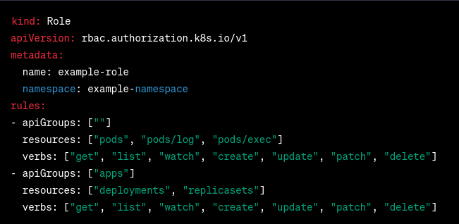
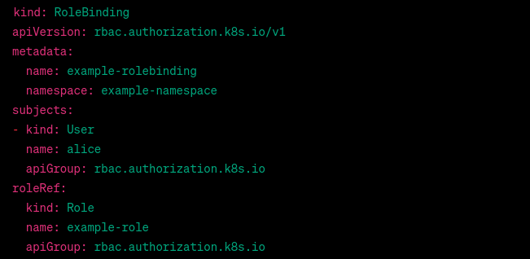
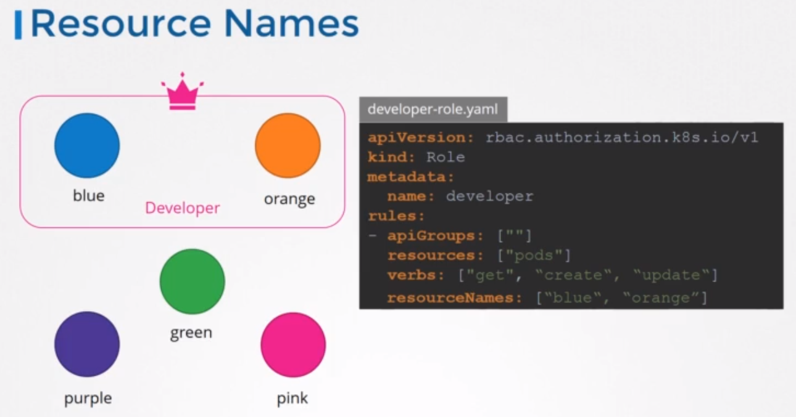

#  Role-Based Access Control RBAC

## ** How do we create a role?
### * by creating a role object. So, we create a role definition file.


This example RBAC file creates a Role named [example-role] in the [example-namespace] namespace. The rules section defines the permissions granted by the role.

The first rule grants permissions to perform various actions on pods, including getting, listing, watching, creating, updating, patching, and deleting pods, as well as viewing pod logs and executing commands in pods. The second rule grants permissions to perform similar actions on deployments and replicasets in the apps API group.

To use this RBAC role, you would need to create a `RoleBinding` or `ClusterRoleBinding` that binds the role to one or more users or service accounts.

> Note: For Core group you can leave the API group section as blank.

### * The next step is to link the user to that role. For this, we create another object called roll binding. The roll binding object links a user object to a role.


This RoleBinding binds the [example-role] Role to the [alice] user in the [example-namespace] namespace. The subjects section specifies the user as a User kind, with the name field set to alice. The roleRef section specifies the Role to bind, with the name field set to [example-role].

With this RoleBinding, the [alice] user will have the permissions defined in the [example-role Role]. Note that you can also use ServiceAccount instead of User in the subjects section to bind the Role to a service account instead of a user.
> Note you can use ClusterRoleBinding instead of RoleBinding to bind the role to all namespaces in the cluster.

## `** What if you being a user would like to see if you have access to a particular resource in the cluster?`
```
kubectl auth can-i create deployments
```

```
kubectl auth can-i delete deployments
```
### * You can test another user without authenticate as the user to test it.
```
kubectl auth can-i create deployments --as <user-name>
```

## `* You can go one level down and allow access to specific resources alone.`
### - For example, say you have five pods in namespace you wanna give access to a user to pods, but not all pods.
### - You can do that by adding a `resourceNames` field to the rule.

