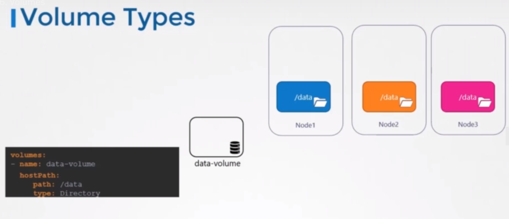

# `HostPath`: 
### A directory on the host machine that is mounted into the pod. This can be used to access data on the host machine from within the pod.

* Suppose you have a pod with a single container that needs to access a file on the host machine. For example, the container may need to read a configuration file or access a database file that is stored on the host.

* To make the file accessible to the container, you can use a HostPath volume. Here's an example manifest file that defines the pod:
```
apiVersion: v1
kind: Pod
metadata:
  name: host-path-pod
spec:
  containers:
  - name: my-container
    image: my-image
    volumeMounts:
    - name: host-path-volume
      mountPath: /host/path/file.txt
  volumes:
  - name: host-path-volume
    hostPath:
      path: /path/on/host/machine

```

* In this example, the `HostPath` volume is named `host-path-volume` and is mounted at the directory `/host/path` in the container. The path field in the hostPath configuration specifies the path on the host machine where the file is located.

When the pod is created, the file at `/path/on/host/machine/file.txt` will be mounted into the container at `/host/path/file.txt`. The container can then read and write to the file as needed.

> Note: that the use of HostPath volumes can pose security risks, as it allows containers to access files on the host machine. Use this volume type with caution and only when necessary.

> Note: It is not recommended for use in a multi node cluster. This is because the pods would use the slash data directory on all the nodes, and expect all of them to be the same and have the same data.

