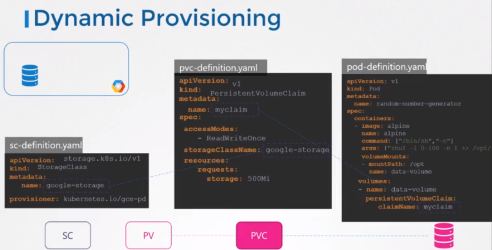

# Storage Classes

###  we create a PVC from a Google Cloud persistent disk.
### The problem here is that before this PV is created, you must have created the disk on Google Cloud.
### Every time an application requires storage, you have to first manually provision the disk on Google Cloud, and then manually create a persistent volume definition file using the same name as that of the disk that you created.

- using a StorageClass provides a more efficient and automated way of managing storage in Kubernetes, as it allows you to define storage classes that match your application's requirements and lets Kubernetes dynamically provision and manage PersistentVolumes based on those classes.

- With storage classes, you can define a provisioner, such as Google Storage, that can automatically provision storage on Google Cloud and attach that to pods when a claim is made.

## Example:
```
kind: StorageClass
apiVersion: storage.k8s.io/v1
metadata:
  name: fast-storage
provisioner: kubernetes.io/aws-ebs
parameters:
  type: gp2
  iopsPerGB: "10"
reclaimPolicy: Retain

```

> For the PVC to use the storage class we defined, we specify the storage class name in the PVC definition.

```
apiVersion: v1
kind: PersistentVolumeClaim
metadata:
  name: my-pvc
spec:
  storageClassName: fast-storage
  accessModes:
    - ReadWriteOnce
  resources:
    requests:
      storage: 10Gi

```


