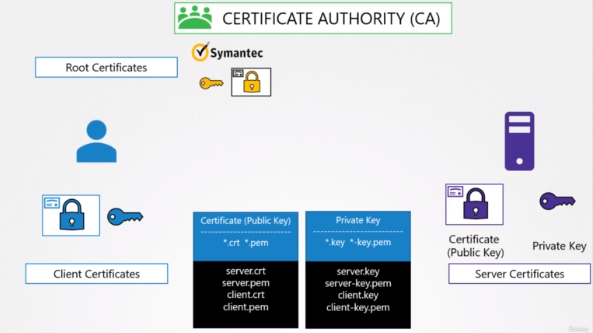

# TLS certificates in Kubernetes

### TLS certificates in Kubernetes are used to establish secure communication channels between various components. 
### There are `Three` types of certificates used in Kubernetes:

## 1- `Server Certificates`
### (Api server - ETCD server - Kubelete server)

* Server certificates are used to authenticate the Kubernetes API server to other components in the cluster. They contain information about the server's public key and identity, and are used to encrypt data between the API server and other components in the cluster. 
* The API server generates a `self-signed` certificate when it is first installed, but this certificate is not suitable for use in production environments.

* To create a server certificate in Kubernetes, you can use a tool like kubeadm or cert-manager. These tools allow you to create a Certificate Signing Request (CSR) that can be sent to a trusted Certificate Authority (CA) to issue a server certificate. Once the server certificate is issued, it can be installed on the API server and used to secure communication with other components.

## 2- `Client Certificates`
### (Admins - Kube Schedule - Kube Controler - Kube Proxy) - and anything speak with kube-api server

* Client certificates are used to authenticate Kubernetes components to the API server. They contain information about the client's public key and identity, and are used to encrypt data between the client and the API server. Various Kubernetes components such as kubelet, kube-proxy, and the Kubernetes dashboard use client certificates to authenticate themselves to the API server.

* To create a client certificate in Kubernetes, you can use the same tools as for creating a server certificate. Once the client certificate is issued, it can be installed on the component that needs to authenticate itself to the API server.

## 3- `Root Certificates`
* CA Certificates is used to sign server and client Certificates.

## `Managing TLS Certificates in Kubernetes`

* Kubernetes provides an inbuilt certificate management system called kube-apiserver, which generates and manages the server certificate for the API server. However, managing client certificates manually can be cumbersome, especially in large clusters.

* To simplify the management of TLS certificates in Kubernetes, you can use tools like `cert-manager`. Cert-manager is an open-source tool that automates the issuance and renewal of TLS certificates in Kubernetes. It can be used to automatically generate and manage TLS certificates for Kubernetes components, and can also integrate with external Certificate Authorities (CAs) for issuing certificates.

# `Note 1`:
## The servers communicate amongst them as well. For example:
### - the kube-apiserver communicates with the etcd server.
### - In fact, of all the components, the kube-apiserver is the only server that talks to the etcd server.
### - So as far as the `etcd server is concerned, the kube-apiserver is a client`, so it needs to authenticate.
### - The kube-apiserver can use the same keys that it used earlier for serving its own API service.
    apiserver.crt    &    apiserver.key
### - Or you can generate a new pair of certificates specifically for the kube-apiserver to authenticate to the etcd server.

# `Note 1`:
## The kube-apiserver also talks to the kubelet server on each of the individual nodes.
### - It can use the original certificates, or generate new ones specifically for this purpose.

## Kubernetes requires you to have at least one certificate authority for your cluster.
## In fact, you can have more than one.
### - One for all the components in the cluster
### - another one specifically for etcd.

- In that case, the etcd servers certificates and the etcd servers client certificates, which in this case is the API server client certificate, will be all signed by the etcd server CA.