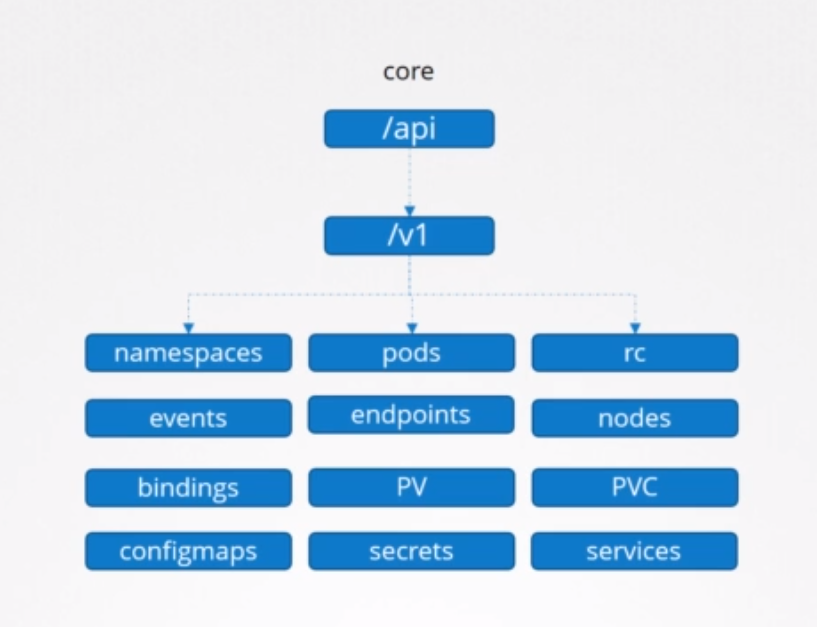
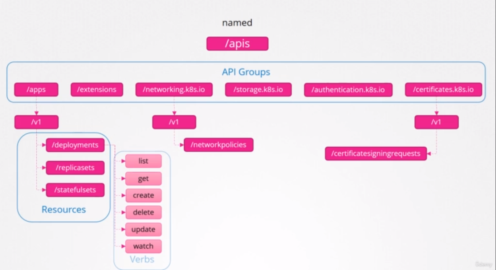

# API Groups

### The Kubernetes API is grouped into multiple groups based on their purpose, such as:
* APIs.
* health.
* metrics.
    - The Metrics and Health API are used to monitor the health of the cluster.
* logs.
    - The logs are used for integrating with third-party logging applications.
* version API: is for viewing the version of the cluster.

## These APIs are categorized into two:
### * The core group `[/API]`.
    * The core group is where all core functionality exists, such as name, spaces, pods, replication controllers, events and points, nodes, bindings, persistent volumes, persistent volume claims, conflict maps, secrets, services.

### * The named group `[/APIs]`.
    * The named group APIs are more organized
    * all the newer features are going to be made available through these named groups.
