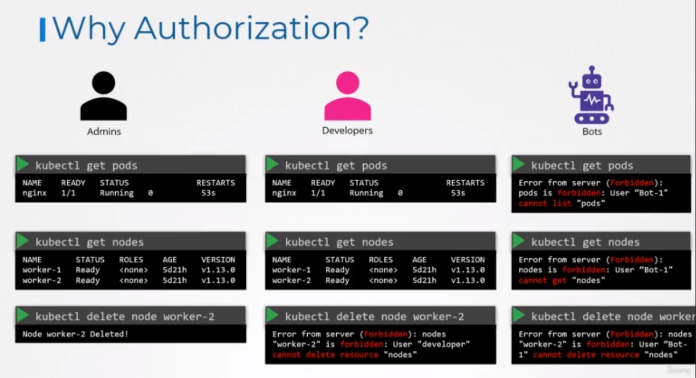
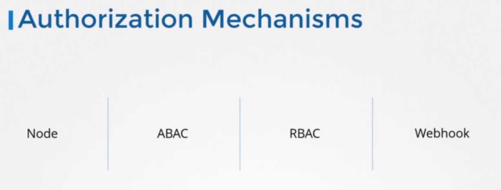
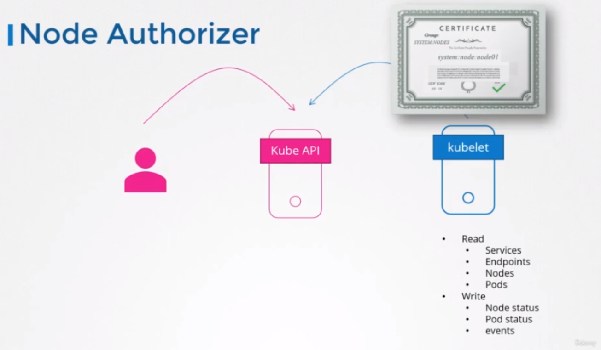
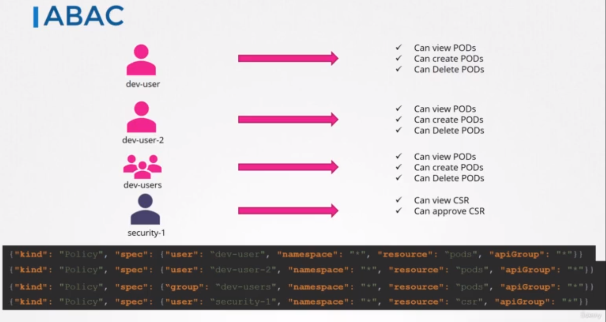
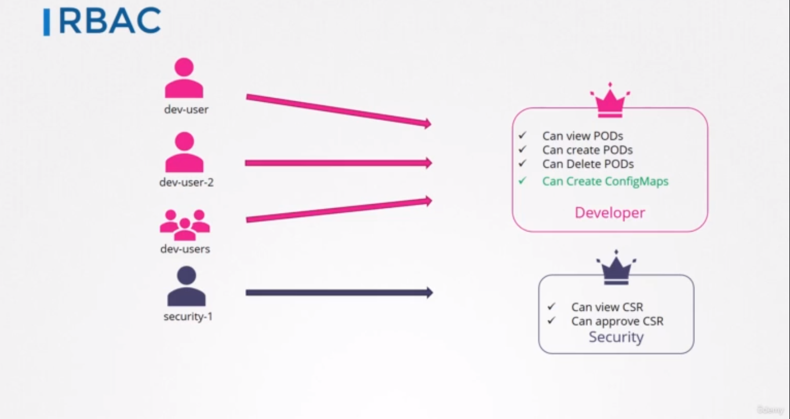
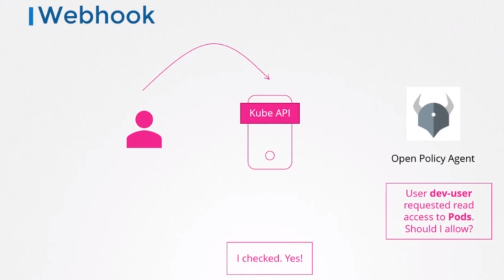
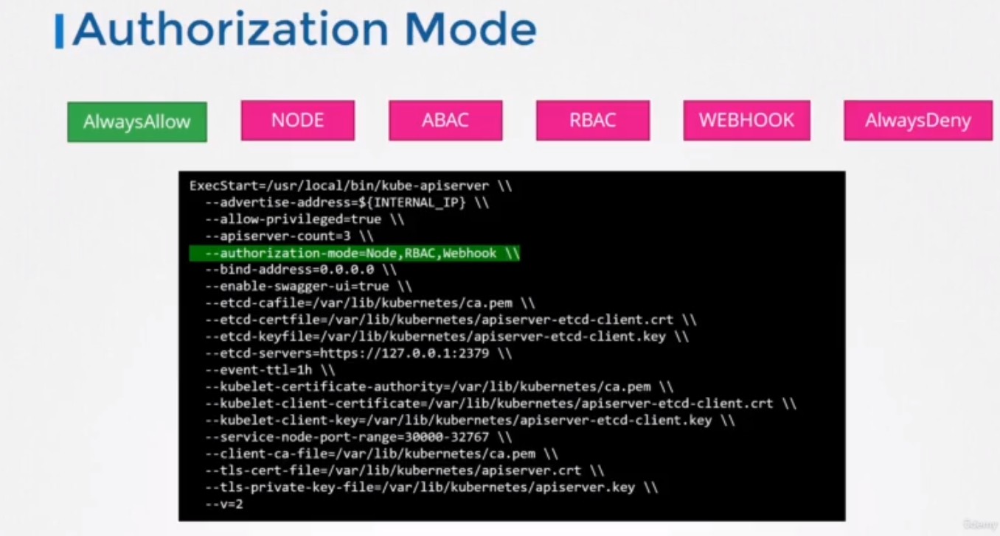
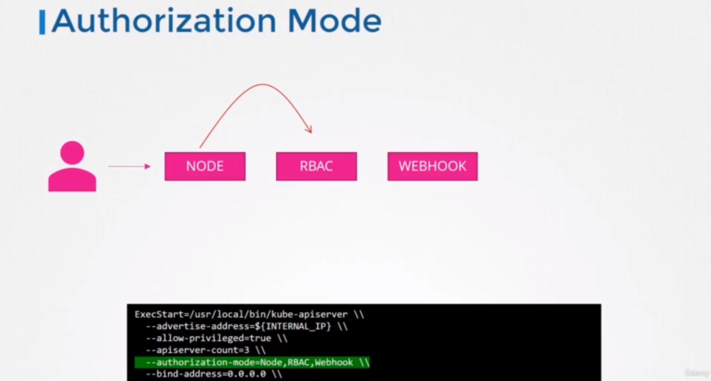

# Authentication

### A human or a machine, can get access to the cluster. Once they gain access, what can they do? That's what authorization defines.

## ** Why do you need authorization in your cluster?
### * As an administrator of the cluster we were able to perform all sorts of operations in it, such as viewing various objects like pods and nodes and deployments, creating or deleting objects such as adding or deleting pods or even nodes in the cluster. As an admin, we are able to perform any operation.
### * but soon we will have others accessing the cluster as well such as the other administrators, users, testers or other applications like monitoring applications or continuous delivery applications like Jenkins.
### * So, we will be creating accounts for them to access the cluster by creating usernames and passwords or tokens, or signed TLS certificates or service accounts.
### * But we don't want all of them to have the same level of access.


# ** There are different `authorization mechanisms` supported by Kubernetes, such as:
    1- node authorization.
    2- attribute-based authorization*
    3- role-based authorization.
    4- webhook.


## `1- Node Authorizer:`
### * the kubelets should be part of the system nodes group and have a name prefixed with system node.
### * So any request coming from a user with the name system node and part of the system nodes group is authorized by the node authorizer, and are granted these privileges,the privilege is required for a kubelet.


## `2- Attribute-based authorization ABAC:`
### * is where you associate a user or a group of users with a set of permissions. In this case, we say the dev user can view, create and delete pods.
### * do this by creating a `policy file` with a set of policies defined in `json format` this way you pass this file into the API server.
### * Similarly, we create a policy definition file for each user or group in this file. 
> Note: every time you need to add or make a change in the security, you must edit this policy file manually and restart the Kube API Server. So the attribute-based access control configurations are difficult to manage.



## `3- Role-based access control RBAC:`
### * instead of directly associating a user or a group with a set of permissions, we define a `role`.
### * We create a role with the set of permissions required for users then we associate all the users to that role.
### * whenever a change needs to be made to the user's access we simply modify the role and it reflects on all users immediately.


## `4- webhook:`
### what if you want to outsource all the authorization mechanisms .. Say you want to manage authorization externally?
### * For instance, `Open Policy Agent` is a third-party tool that helps with admission control and authorization.
### * Kubernetes make an API call to the Open Policy Agent with the information about the user and his access requirements, and have the Open Policy Agent decide if the user should be permitted or not.



# `Always Allow and Always Deny`
## * Always Allow: allows all requests without performing any authorization checks.
## * Always Deny: denies all requests.

### - The modes are set using the Authorization Mode Option on the Kube API Server.
```
--authorization-mode=AlwaysAllow
```
### - If you don't specify this option, it is set to `Always Allow by default`.
### - You may provide a comma separated list of multiple modes that you wish to use.
```
--authorization-mode=node,RBAC,webhook
```


### - When you have multiple modes configured your request is authorized using each one in the order it is specified. For example, when a user sends a request it's first handled by the Node Authorizer. The Node Authorizer handles only node requests, so it denies the request. Whenever a model denies a request it is forwarded to the next one in the chain.
### The role-based access control module performs its checks and grants the user permission. Authorization is complete and user is given access to the requested object.


