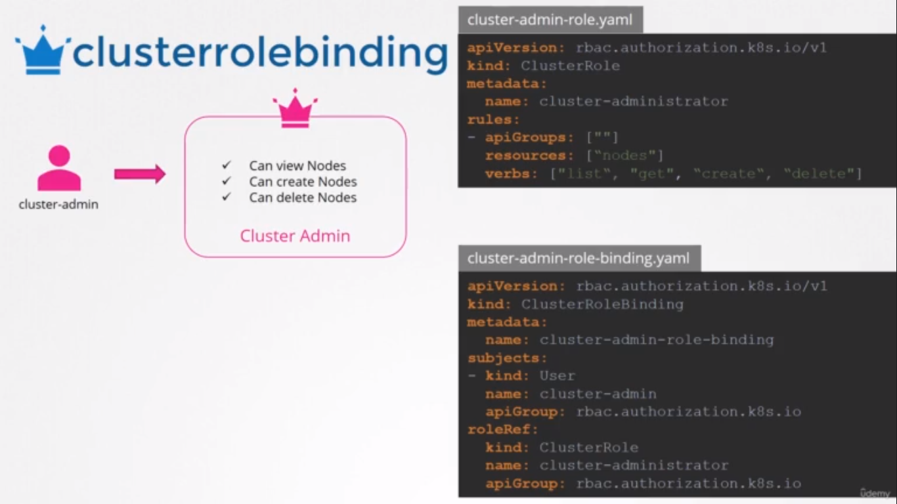

# Cluster Roles and Cluster Role Bindings

### * roles and role bindings are namespaced, meaning they are created within namespaces.

### If you don't specify a namespace, they are created in the default namespace and control access within that namespace alone.

### * But what about other resources like nodes? Can you group or isolate nodes within a namespace?

### So the resources are categorized as either namespaced or cluster-scoped.

### * To see a full list of namespaced resources:
```
kubectl api-resources --namespaced=true
```
### * To see a full list of non-namespaced resources:
```
kubectl api-resources --namespaced=false
```
### * Cluster roles are just like roles, except they are for cluster-scoped resources. 
### For example, a cluster admin role can be created to provide a cluster administrator permissions to view, create, or delete nodes in a cluster.



> Note: You can create a cluster role for namespaced resources as well. When you do that, the user will have access to these resources across all namespaces.

-  `when we created a role to authorize a user to access pod, the user had access to pods in a particular namespace alone.`

- `With cluster roles, when you authorize a user to access the pods, the user gets access to all pods across the cluster.`