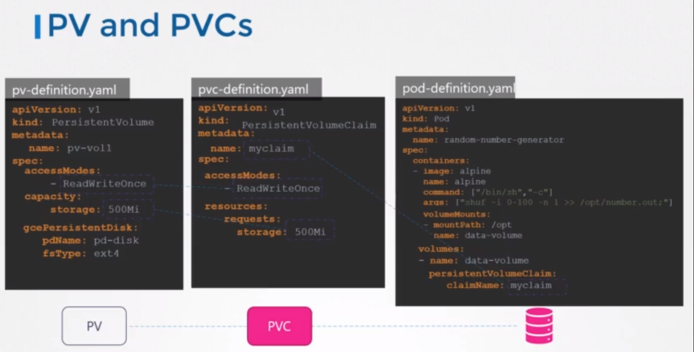

# `PersistentVolume (PV) & PersistentVolumeClaim (PVC)`: 
## A volume that is backed by a persistent storage device, such as a network-attached storage (NAS) or a cloud storage service. PVCs can be used to persist data beyond the lifetime of a pod.



* Let's assume we have an application that needs to store some data persistently. To achieve this, we can create a `PersistentVolume` resource that represents a storage volume in the cluster. Here's an example of a PersistentVolume resource definition:
```
apiVersion: v1
kind: PersistentVolume
metadata:
  name: my-pv
spec:
  capacity:
    storage: 1Gi
  accessModes:
  - ReadWriteOnce
  persistentVolumeReclaimPolicy: Retain
  storageClassName: standard
  hostPath:
    path: /data/my-pv

```
* In this example, we're using a HostPath volume plugin to create a PersistentVolume named my-pv. The capacity field specifies the size of the volume, and the accessModes field specifies that the volume can be mounted as read-write by a single node at a time. The persistentVolumeReclaimPolicy field specifies that the volume should be retained even after the pod that used it is deleted. The storageClassName field specifies the name of the storage class to use for provisioning this volume, and the hostPath field specifies the path on the host machine where the volume should be created.


## `persistentVolumeReclaimPolicy` is a field in the `PersistentVolume` resource in Kubernetes that determines what happens to the underlying storage when the `PersistentVolumeClaim` using it is deleted. 

- `Retain`: When a PersistentVolumeClaim using this volume is deleted, the underlying storage is retained and `needs to be manually cleaned up`. This policy is useful when you want to retain data in the volume even after the PersistentVolumeClaim is deleted, such as for data recovery or forensic purposes.

- `Delete`: When a PersistentVolumeClaim using this volume is deleted, the underlying storage is deleted as well. This policy is useful when the data in the volume is no longer needed after the PersistentVolumeClaim is deleted.

- `Recycle`: When a PersistentVolumeClaim using this volume is deleted, the underlying storage is formatted and `made available for reuse`. This policy is useful when the data in the volume is not sensitive and can be deleted without any special considerations.

- `Archive`: When a PersistentVolumeClaim using this volume is deleted, the underlying storage is `archived to a long-term storage`, such as object storage, for long-term retention. This policy is useful when you want to retain the data for compliance or regulatory purposes.

## The available options for `accessModes`:

- `ReadWriteOnce`: The volume can be mounted as read-write by a single node at a time.
- `ReadOnlyMany`: The volume can be mounted as read-only by multiple nodes simultaneously.
- `ReadWriteMany`: The volume can be mounted as read-write by multiple nodes simultaneously.


* Now that we have a PersistentVolume, we can create a PersistentVolumeClaim resource that requests storage from the PersistentVolume. Here's an example of a PersistentVolumeClaim resource definition:
```
apiVersion: v1
kind: PersistentVolumeClaim
metadata:
  name: my-pvc
spec:
  accessModes:
  - ReadWriteOnce
  resources:
    requests:
      storage: 500Mi
  storageClassName: standard

```
* In this example, we're creating a PersistentVolumeClaim named my-pvc that requests 500 MB of storage from a volume provisioned by the standard storage class. The accessModes field specifies that the volume can be mounted as read-write by a single node at a time. The resources field specifies the amount of storage to request, and the storageClassName field specifies the name of the storage class to use for provisioning the volume.
* When a PersistentVolumeClaim is created, Kubernetes will attempt to find a suitable PersistentVolume to bind to the claim.

> Note: The PersistentVolumeClaim volume type requires a storage provider to be configured in the Kubernetes cluster. This can be a local storage device, a network-attached storage (NAS) device, or a cloud storage service. 

> Note: The storage provider must be configured and made available to Kubernetes before the PersistentVolumeClaim volume can be used.


## In Kubernetes, there are different types of PersistentVolumes available, each designed to support different types of storage backends. Some of the common PersistentVolume types are:

1- HostPath: A HostPath volume uses a directory on the node's file system as a storage backend. This type of PersistentVolume is typically used for development and testing purposes.

2- NFS: An NFS volume uses a network file system as a storage backend. This type of PersistentVolume is useful when you need to share data across multiple nodes in the cluster.

3- iSCSI: An iSCSI volume uses a storage area network (SAN) as a storage backend. This type of PersistentVolume is useful when you need high-performance storage and low-latency access to data.

4- CephFS: A CephFS volume uses the Ceph distributed file system as a storage backend. This type of PersistentVolume is useful when you need scalable and reliable storage for your application.

5- GlusterFS: A GlusterFS volume uses the GlusterFS distributed file system as a storage backend. This type of PersistentVolume is useful when you need scalable and reliable storage for your application.

6- AzureDisk: An AzureDisk volume uses the Azure Disk storage service as a storage backend. This type of PersistentVolume is useful when you need to store data in the cloud and need high-performance access to the data.

7- AWS EBS: An AWS EBS volume uses the Amazon Elastic Block Store (EBS) as a storage backend. This type of PersistentVolume is useful when you need to store data in the cloud and need high-performance access to the data.

- These are just a few examples of PersistentVolume types available in Kubernetes. Each type is designed to support different storage backends and has its own set of advantages and limitations. When choosing a PersistentVolume type, it is important to consider the storage requirements of your application and choose the appropriate type based on those requirements.